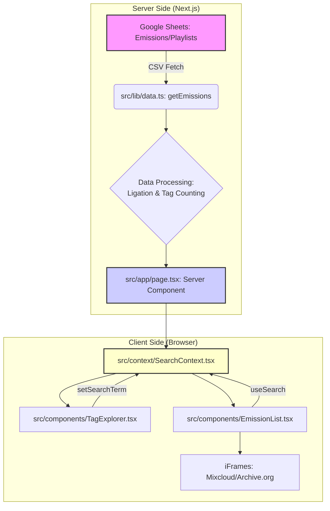

# 🏗️ Architecture Technique du Projet

## 1. Schéma d'Architecture et Flux de Données

Le projet suit une architecture **JAMstack** (JavaScript, APIs, Markup) optimisée par Next.js. Le flux de données est conçu pour maximiser la performance en chargeant les données une seule fois côté serveur.

## 2. Détail du Data Layer (`src/lib/data.ts`)

Ce fichier est le cœur de l'application. Il effectue les opérations suivantes :

*   **Fetch & Parsing :** Utilise `PapaParse` pour lire les deux liens CSV publics.
*   **Ligation :** Lie les lignes de l'onglet `Playlists` aux émissions correspondantes via la colonne `Numéro`.
*   **Agrégation :**
    *   **`globalTags` :** Compte la fréquence de chaque Artiste (y compris les artistes multiples séparés par des virgules) pour le nuage de tags.
    *   **`globalGenres` :** Compte la fréquence de chaque Genre (issu de la colonne `Genre` de la playlist) pour le nuage de genres.
*   **Recherche :** Génère une chaîne de caractères unique (`searchableText`) pour chaque émission, incluant le Titre, la Date, l'Invité, les Artistes et les Genres. Cette chaîne est utilisée pour la recherche instantanée.

## 3. Stratégie de Performance et UX

*   **Performance Critique (ISR) :** La page utilise l'**Incremental Static Regeneration** (`export const revalidate = 3600;`) pour mettre en cache les données pendant 1 heure. Cela résout le problème critique du **N+1** (multiples requêtes Mixcloud/Google Sheets) et garantit une performance constante en production.
*   **Rendu Côté Serveur (SSR/SSG) :** La fonction `getEmissions` est appelée côté serveur pour un chargement initial très rapide.
*   **Lazy Loading (Lecteur) :** Les iFrames des lecteurs audio ne sont chargés que lorsque l'utilisateur clique sur la vignette.
*   **Accessibilité (A11y) :** Le composant `TagExplorer` utilise une structure **DIV/BUTTON** pour le header, respectant le standard HTML et permettant la navigation au clavier.
*   **Filtrage Efficace :** Le filtrage dans `EmissionList.tsx` utilise le hook `useMemo` pour ne recalculer la liste filtrée que lorsque le `searchTerm` change.

## 4. Bonnes Pratiques et Points de Vigilance

*   **Typage (TypeScript) :** L'utilisation d'interfaces (`Emission`, `PlaylistItem`, `GlobalTags`) garantit la cohérence des données du début à la fin de l'application.
*   **Sécurité (Images) :** Le fichier `next.config.ts` autorise les sous-domaines dynamiques d'Archive.org (`*.archive.org`) pour garantir le chargement des images.
*   **Robustesse (Mixcloud) :** Les appels Mixcloud sont sécurisés par un `AbortController` avec un timeout de 2 secondes pour éviter de bloquer le build en cas de latence de l'API.