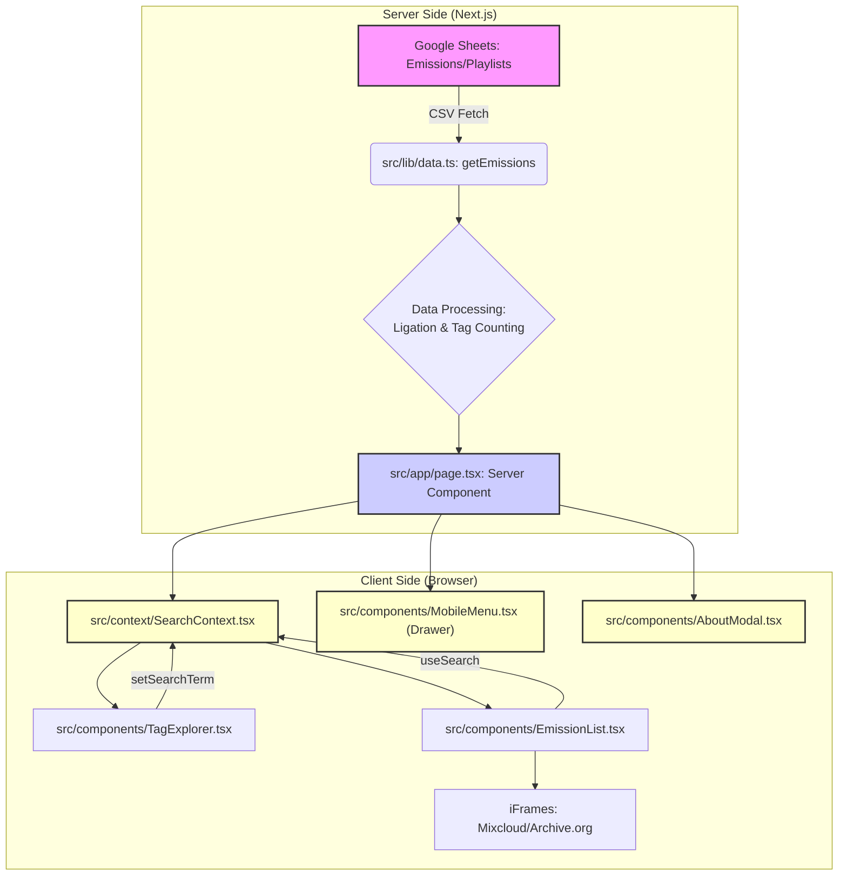

# 🏗️ Architecture Technique du Projet

## 1. Schéma d'Architecture et Flux de Données

Le projet suit une architecture **JAMstack** (JavaScript, APIs, Markup) optimisée par Next.js. Le flux de données est conçu pour maximiser la performance en chargeant les données une seule fois côté serveur.

## 2. Détail du Data Layer (`src/lib/`)

L'architecture de données a été découplée en deux fichiers distincts pour optimiser le poids du bundle envoyé au client (Tree Shaking) tout en conservant la logique métier côté serveur.

*   **`src/lib/types.ts` (Universel & Léger) :**
    *   Contient uniquement les définitions d'interfaces TypeScript (`Emission`, `PlaylistItem`, `GlobalTags`).
    *   **Rôle :** Permet aux composants clients (`EmissionList`, `TagExplorer`) de typer les données sans importer de logique métier lourde.

*   **`src/lib/data.ts` (Serveur Uniquement) :**
    *   Contient la logique d'ingestion et les dépendances lourdes (`papaparse`).
    *   **Fetch & Parsing :** Utilise `PapaParse` pour lire les deux liens CSV publics.
    *   **Ligation :** Lie les lignes de l'onglet `Playlists` aux émissions correspondantes via la colonne `Numéro`.
    *   **Agrégation :**
        *   **`globalTags` :** Compte la fréquence de chaque Artiste (y compris les artistes multiples séparés par des virgules) pour le nuage de tags.
        *   **`globalGenres` :** Compte la fréquence de chaque Genre (issu de la colonne `Genre` de la playlist) pour le nuage de genres.
    *   **Gestion des Images (Stratégie Hybride) :**
        *   **Mixcloud :** Récupération via l'API oEmbed (avec Timeout sécurisé).
        *   **Archive.org (Optimisé) :** Construction **déterministe** des URLs d'images HD basée sur une convention de nommage stricte (`Tupi{XX}_itemimage.jpg`). Cela supprime la dépendance à l'API de métadonnées d'Archive.org, rendant le build quasi-instantané.
    *   **Recherche :** Génère une chaîne de caractères unique (`searchableText`) pour chaque émission, incluant le Titre, la Date, l'Invité, les Artistes et les Genres. Cette chaîne est utilisée pour la recherche instantanée.
    *   **Sécurité :** Ce fichier n'est jamais importé côté client, garantissant que la librairie `papaparse` reste sur le serveur.

## 3. Stratégie de Performance et UX

*   **Performance Critique (ISR) :** La page utilise l'**Incremental Static Regeneration** (`export const revalidate = 3600;`) pour mettre en cache les données pendant 1 heure. Cela résout le problème critique du **N+1** (multiples requêtes Mixcloud/Google Sheets) et garantit une performance constante en production.
*   **Rendu Côté Serveur (SSR/SSG) :** La fonction `getEmissions` est appelée côté serveur pour un chargement initial très rapide des données brutes.
*   **Optimisation du LCP (Largest Contentful Paint) :**
    *   **Priorisation :** Les 4 premières images de la grille utilisent la propriété `priority` de `next/image`. Elles sont préchargées par le navigateur, améliorant drastiquement la vitesse d'affichage perçue.
    *   **Zéro Latence :** Suppression des appels API bloquants pour les images Archive.org au profit d'URLs directes.
*   **Gestion du DOM & TBT (Total Blocking Time) :**
    *   **Pagination Client-Side :** Seules les 12 premières émissions sont affichées au chargement ("Load More"). Cela divise par 6 le temps de calcul de mise en page (`Style & Layout`) du navigateur.
    *   **Rendu Conditionnel (Tags) :** Le contenu du `TagExplorer` (300+ boutons) n'est injecté dans le DOM que lorsque l'utilisateur ouvre l'accordéon, réduisant le poids initial de la page.
*   **Optimisation Avancée du Bundle JS :**
    *   **Tree Shaking :** Séparation stricte des types et de la logique de données.
    *   **Modern Build :** Configuration de `browserslist` (`not IE 11`) et `tsconfig` (`ES2017`) pour éliminer les "Polyfills" et le "Legacy JavaScript", réduisant la charge CPU sur mobile.
    *   **Config Next.js :** Utilisation de `transpilePackages` et `optimizePackageImports`.
*   **Lazy Loading (Lecteur) :** Les iFrames des lecteurs audio (Mixcloud/Archive) ne sont chargés que lorsque l'utilisateur clique sur la vignette, économisant énormément de bande passante.
*   **Filtrage Efficace :** Le filtrage dans `EmissionList.tsx` utilise le hook `useMemo` pour ne recalculer la liste filtrée que lorsque le `searchTerm` change.
*   **Accessibilité (A11y & WCAG) :**
    *   **Structure Sémantique :** Le composant `TagExplorer` utilise une structure **DIV/BUTTON** pour le header, respectant le standard HTML et permettant la navigation au clavier.
    *   **Contrastes :** Respect strict des ratios de contraste (Textes en `gray-900`, Badges en `orange-700`/`blue-700`) pour une lisibilité optimale.
*   **Compatibilité Mobile (Player) :** Désactivation de l'autoplay sur les iframes tiers pour assurer un rendu graphique correct du widget Mixcloud sur iOS/Android et respecter les contraintes d'économie de données.
*   **Interface Mobile-First (Layout & Navigation) :**
    *   **Grille Dense :** Affichage en **2 colonnes** sur mobile pour maximiser la densité d'information visible sans scroller.
    *   **Navigation Adaptative :** Header statique sur Desktop vs Architecture "Off-Canvas" (Menu Tiroir) sur Mobile via le composant `MobileMenu`.
    *   **Sticky Header Stabilisé :** Gestion fine des positions `sticky` et des marges négatives pour éviter les sauts visuels et la transparence au scroll.
*   **Architecture de la Modale (Sandwich) :** Structure Flexbox avec Header et Footer fixes. Seule la zone centrale (Player + Playlist) est scrollable, garantissant l'intégrité des coins arrondis et l'accès permanent aux contrôles.

## 4. Bonnes Pratiques et Points de Vigilance

*   **Typage (TypeScript) :** L'utilisation d'interfaces centralisées dans `types.ts` (`Emission`, `PlaylistItem`, `GlobalTags`) garantit la cohérence des données du début à la fin de l'application sans couplage fort.
*   **Sécurité (Images) :** Le fichier `next.config.ts` autorise les sous-domaines dynamiques d'Archive.org (`*.archive.org`) pour garantir le chargement des images.
*   **Robustesse (Mixcloud) :** Les appels Mixcloud sont sécurisés par un `AbortController` avec un timeout de 2 secondes pour éviter de bloquer le build en cas de latence de l'API.

## 5. Infrastructure & Déploiement

*   **Hébergement :** Vercel (Edge Network) pour une distribution mondiale et une latence minimale.
*   **Domaine :** `tupiornot.fr` (Registrar: OVHcloud).
*   **Gestion DNS :** Délégation des Nameservers vers Vercel pour une propagation rapide et une gestion simplifiée.
*   **Sécurité (SSL) :** Certificats HTTPS générés et renouvelés automatiquement par Vercel (Let's Encrypt).
*   **Redirection :** Le sous-domaine `www` redirige automatiquement vers le domaine racine (308 Permanent Redirect) pour consolider le SEO.