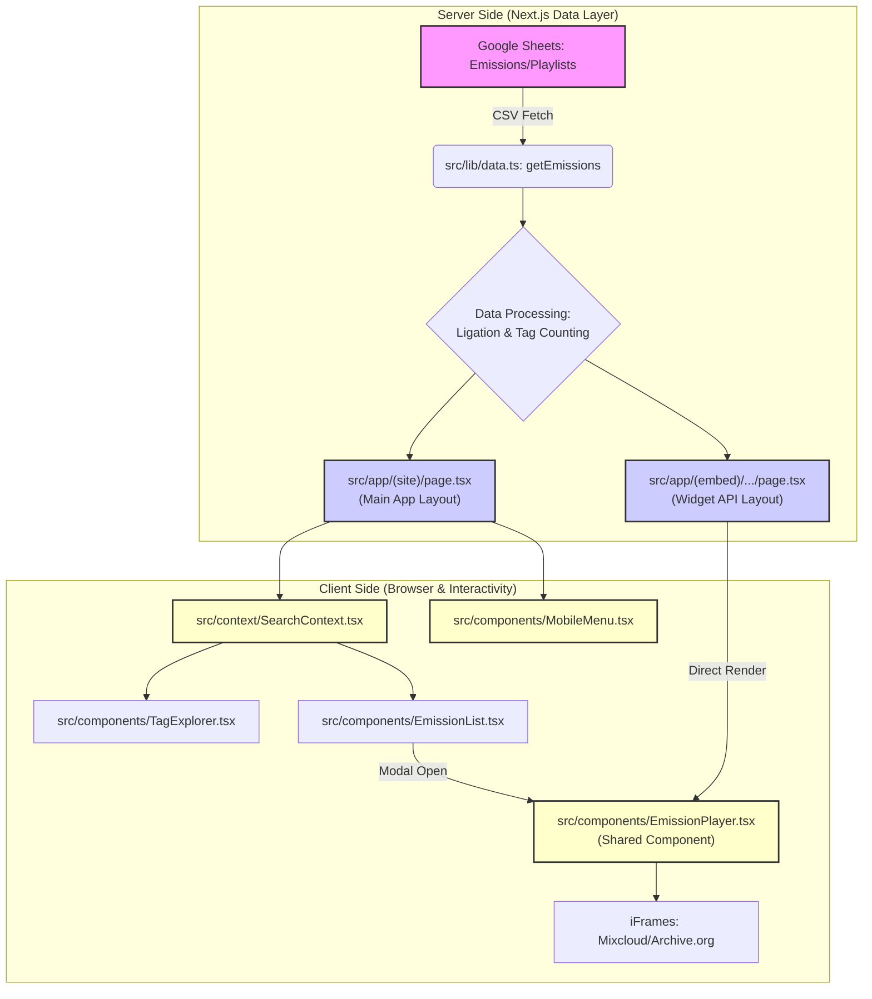

# 🏗️ Architecture Technique du Projet

## 1. Schéma d'Architecture et Flux de Données

Le projet suit une architecture **JAMstack** (JavaScript, APIs, Markup) optimisée par Next.js 16. Le flux de données est conçu pour maximiser la performance en chargeant les données une seule fois côté serveur.

**Évolutions notables en v1.1.0 :**
L'application est désormais segmentée en deux zones via les **Route Groups** `(site)` et `(embed)`, mais partage une logique de données et de composants commune.

*   **Route Groups :** Séparation des routes en `(site)` (avec Header/Footer) et `(embed)` (Layout nu).
*   **Composant Partagé :** `EmissionPlayer.tsx` est désormais le composant central d'affichage, utilisé à la fois dans la Modale du site principal et comme page unique pour les Widgets externes.

```mermaid
flowchart TD
    %% Définition des styles (Classes)
    classDef source fill:#f9f,stroke:#333,stroke-width:2px;
    classDef server fill:#ccf,stroke:#333,stroke-width:2px;
    classDef client fill:#ffc,stroke:#333,stroke-width:2px;

    subgraph Server ["Server Side (Next.js Data Layer)"]
        %% :::source applique la classe 'source' au noeud A
        A["Google Sheets: Emissions/Playlists"]:::source -->|CSV Fetch| B("src/lib/data.ts: getEmissions")
        B --> C{"Data Processing:<br/>Ligation & Tag Counting"}
        
        %% Branching vers les deux layouts
        C --> D1["src/app/(site)/page.tsx<br/>(Main App Layout)"]:::server
        C --> D2["src/app/(embed)/.../page.tsx<br/>(Widget API Layout)"]:::server
    end

    subgraph Client ["Client Side (Browser & Interactivity)"]
        %% Flux Site Principal
        D1 --> E["src/context/SearchContext.tsx"]:::client
        D1 --> I["src/components/MobileMenu.tsx"]:::client
        E --> F["src/components/TagExplorer.tsx"]
        E --> G["src/components/EmissionList.tsx"]
        
        %% Flux Widget & Player Partagé
        G -->|Modal Open| K["src/components/EmissionPlayer.tsx<br/>(Shared Component)"]:::client
        D2 -->|Direct Render| K
        
        %% Sortie Finale
        K --> H["iFrames: Mixcloud/Archive.org"]
    end
```

## 2. Détail du Data Layer (`src/lib/`)

L'architecture de données a été découplée en deux fichiers distincts pour optimiser le poids du bundle envoyé au client (Tree Shaking) tout en conservant la logique métier côté serveur.

*   **`src/lib/types.ts` (Universel & Léger) :**
    *   Contient uniquement les définitions d'interfaces TypeScript (`Emission`, `PlaylistItem`, `GlobalTags`).
    *   **Rôle :** Permet aux composants clients (`EmissionList`, `TagExplorer`) de typer les données sans importer de logique métier lourde.

*   **`src/lib/data.ts` (Serveur Uniquement) :**
    *   Contient la logique d'ingestion et les dépendances lourdes (`papaparse`).
    *   **Fetch & Parsing :** Utilise `PapaParse` pour lire les deux liens CSV publics.
    *   **Ligation :** Lie les lignes de l'onglet `Playlists` aux émissions correspondantes via la colonne `Numéro`.
    *   **Agrégation :**
        *   **`globalTags` :** Compte la fréquence de chaque Artiste (y compris les artistes multiples séparés par des virgules) pour le nuage de tags.
        *   **`globalGenres` :** Compte la fréquence de chaque Genre (issu de la colonne `Genre` de la playlist) pour le nuage de genres.
    *   **Gestion des Images (Stratégie Hybride) :**
        *   **Mixcloud :** Récupération via l'API REST (optimisée pour récupérer Image + Stats en un seul appel)
        *   **Archive.org (Optimisé) :** Construction **déterministe** des URLs d'images HD basée sur une convention de nommage stricte (`Tupi{XX}_itemimage.jpg`). Cela supprime la dépendance à l'API de métadonnées d'Archive.org, rendant le build quasi-instantané.
         *   **Enrichissement & Statistiques :**
        *   **Archive.org (Bulk) :** Utilisation de l'API `views/v1/short` pour récupérer les compteurs d'écoutes de toutes les émissions en une seule requête (Batch), garantissant une performance optimale.
        *   **Agrégation Legacy :** Calcul automatique du total des écoutes (Archive + Mixcloud) pour les émissions migrées, piloté par la colonne `Mixcloud Legacy` du CSV.
    *   **Recherche :** Génère une chaîne de caractères unique (`searchableText`) pour chaque émission, incluant le Titre, la Date, l'Invité, le Thème, les Artistes et les Genres. Cette chaîne est utilisée pour la recherche instantanée.
    *   **Sécurité :** Ce fichier n'est jamais importé côté client, garantissant que la librairie `papaparse` reste sur le serveur.

## 3. Stratégie de Performance et UX

*   **Performance Critique (Caching Granulaire) :**
    *   **ISR (Incremental Static Regeneration) :** Utilisation de la directive `next: { revalidate }` au niveau des appels `fetch` pour mettre en cache les données. Cela résout le problème critique du **N+1** (multiples requêtes Mixcloud/Google Sheets) et garantit une performance constante en production.
    *   **Stratégie Hybride :**
        *   **CSV Google Sheets :** Cache de **1 heure** (`3600s`) pour une mise à jour rapide des contenus.
        *   **APIs Externes (Mixcloud/Archive) :** Cache de **24 heures** (`86400s`) pour les statistiques d'écoute, car elles varient peu et sont coûteuses à récupérer.
    *   **Batch Processing :** Les appels d'enrichissement sont traités par lots (Batch) avec `Promise.allSettled` pour éviter les timeouts au build et garantir qu'une erreur sur une émission ne bloque pas le déploiement.
*   **Rendu Côté Serveur (SSR/SSG) :** La fonction `getEmissions` est appelée côté serveur pour un chargement initial très rapide des données brutes.
*   **Optimisation du LCP (Largest Contentful Paint) :**
    *   **Priorisation :** Les 4 premières images de la grille utilisent la propriété `priority` de `next/image`. Elles sont préchargées par le navigateur, améliorant drastiquement la vitesse d'affichage perçue.
    *   **Zéro Latence :** Suppression des appels API bloquants pour les images Archive.org au profit d'URLs directes.
*   **Gestion du DOM & TBT (Total Blocking Time) :**
    *   **Pagination Client-Side :** Seules les 12 premières émissions sont affichées au chargement ("Load More"). Cela divise par 6 le temps de calcul de mise en page (`Style & Layout`) du navigateur.
    *   **Rendu Conditionnel (Tags) :** Le contenu du `TagExplorer` (300+ boutons) n'est injecté dans le DOM que lorsque l'utilisateur ouvre l'accordéon, réduisant le poids initial de la page.
*   **Filtrage & Recherche (Anti-Lag) :**
    *   **Debounce :** Implémentation d'une temporisation de **300ms** dans le `SearchContext` pour ne déclencher le filtrage lourd que lorsque l'utilisateur cesse de taper.
    *   **Memoization :** Le filtrage dans `EmissionList.tsx` utilise le hook `useMemo` pour ne recalculer la liste filtrée que lorsque le `searchTerm` *stabilisé* change.
        *   **Recherche Multi-Mots :** Algorithme de filtrage inclusif (`.every()`) permettant de combiner plusieurs termes (ex: "Rock Beatles") sans contrainte d'ordre.
*   **Robustesse UX (Error Boundaries) :**
    *   **Page 404 :** Gestion personnalisée des URLs invalides (`not-found.tsx`).
    *   **Crash Handler :** Écran d'erreur avec bouton de reconnexion (`error.tsx`) pour éviter les écrans blancs en cas de défaillance API.
*   **Optimisation Avancée du Bundle JS :**
    *   **Tree Shaking :** Séparation stricte des types et de la logique de données.
    *   **Modern Build :** Configuration de `browserslist` (`not IE 11`) et `tsconfig` (`ES2017`) pour éliminer les "Polyfills" et le "Legacy JavaScript", réduisant la charge CPU sur mobile.
    *   **Config Next.js :** Utilisation de `transpilePackages` et `optimizePackageImports`.
*   **Lazy Loading (Lecteur) :** Les iFrames des lecteurs audio (Mixcloud/Archive) ne sont chargés que lorsque l'utilisateur clique sur la vignette, économisant énormément de bande passante.
*   **Accessibilité (A11y & WCAG) :**
    *   **Structure Sémantique :** Le composant `TagExplorer` utilise une structure **DIV/BUTTON** pour le header, respectant le standard HTML et permettant la navigation au clavier.
    *   **Contrastes :** Respect strict des ratios de contraste (Textes en `gray-900`, Badges en `orange-700`/`blue-700`) pour une lisibilité optimale.
*   **Compatibilité Mobile (Player) :** Désactivation de l'autoplay sur les iframes tiers pour assurer un rendu graphique correct du widget Mixcloud sur iOS/Android et respecter les contraintes d'économie de données.
*   **Interface Mobile-First (Layout & Navigation) :**
    *   **Grille Dense :** Affichage en **2 colonnes** sur mobile pour maximiser la densité d'information visible sans scroller.
    *   **Navigation Adaptative :** Header statique sur Desktop vs Architecture "Off-Canvas" (Menu Tiroir) sur Mobile via le composant `MobileMenu`.
    *   **Sticky Header Stabilisé :** Gestion fine des positions `sticky` et des marges négatives pour éviter les sauts visuels et la transparence au scroll.
*   **Architecture de la Modale (Sandwich) :** Structure Flexbox avec Header et Footer fixes. Seule la zone centrale (Player + Playlist) est scrollable, garantissant l'intégrité des coins arrondis et l'accès permanent aux contrôles.
*   **SEO Social & Deep Linking :**
    *   **Dynamic Metadata :** Utilisation de `generateMetadata` (Server-Side) pour injecter les balises Open Graph (Image, Titre) spécifiques à l'émission partagée.
    *   **URL State :** Gestion des paramètres d'URL (`?id=XX`) via `useSearchParams` pour permettre le partage direct d'une émission spécifique (ouverture automatique de la modale).

## 4. Bonnes Pratiques et Points de Vigilance

*   **Typage (TypeScript) :** L'utilisation d'interfaces centralisées dans `types.ts` (`Emission`, `PlaylistItem`, `GlobalTags`) garantit la cohérence des données du début à la fin de l'application sans couplage fort.
*   **Sécurité (Images) :** Le fichier `next.config.ts` autorise les sous-domaines dynamiques d'Archive.org (`*.archive.org`) pour garantir le chargement des images.
*   **Robustesse (Mixcloud) :** Les appels Mixcloud sont sécurisés par un `AbortController` avec un timeout de **3 secondes** pour éviter de bloquer le build en cas de latence de l'API.
*   **Qualité du Code (CI/CD) :** Le projet intègre des scripts de validation stricts (`typecheck`, `lint:strict`) pour garantir qu'aucun code cassé ou non-conforme ne soit déployé en production.

## 5. Infrastructure & Déploiement

*   **Hébergement :** Vercel (Edge Network) pour une distribution mondiale et une latence minimale.
*   **Domaine :** `tupiornot.fr` (Registrar: OVHcloud).
*   **Gestion DNS :** Délégation des Nameservers vers Vercel pour une propagation rapide et une gestion simplifiée.
*   **Sécurité (SSL) :** Certificats HTTPS générés et renouvelés automatiquement par Vercel (Let's Encrypt).
*   **Redirection :** Le sous-domaine `www` redirige automatiquement vers le domaine racine (308 Permanent Redirect) pour consolider le SEO.
*   **SEO Technique & Social :**
    *   **Indexation :** Génération automatique du `sitemap.xml` et du `robots.txt`.
    *   **Social Graph :** Implémentation du protocole Open Graph (Facebook/LinkedIn) et des Twitter Cards via les métadonnées dynamiques et l'image `opengraph-image.jpg` (File-based Metadata).
    *   **Canonical :** Protection contre le contenu dupliqué via la balise canonique.
*   **Monitoring & Analytics :** Intégration de **Vercel Analytics** pour le suivi d'audience.
    *   **Privacy-First :** La solution est configurée pour être conforme au RGPD sans nécessiter de bandeau de consentement (pas de cookies, données anonymisées, pas de suivi cross-site).
    *   **Performance :** Script ultra-léger chargé de manière asynchrone pour ne pas impacter le score Lighthouse.

## 6. Viabilité & Limites (Plan Vercel Hobby)

L'architecture a été spécifiquement conçue pour rester durablement dans les limites du plan gratuit (**Hobby**) de Vercel :

*   **Bande Passante (100 GB/mois) :**
    *   **Audio Déporté :** Le flux audio (le plus lourd) est streamé directement depuis les serveurs de Mixcloud et Archive.org via des iframes. Il ne consomme **aucune** bande passante sur Vercel.
    *   **Assets :** Seuls le code (JS/CSS) et les images optimisées transitent par Vercel.
*   **Temps de Calcul (Serverless Functions) :**
    *   **Stratégie ISR :** Grâce à la régénération statique (`revalidate = 3600`), le serveur ne calcule la page qu'une fois par heure, quel que soit le trafic. Cela protège contre l'explosion du quota d'heures-serveur.
*   **Optimisation d'Images (1000 sources/mois) :**
    *   Avec un catalogue de ~100 émissions stables (qui ne changent pas tous les jours), le quota de 1000 images sources mensuelles est largement suffisant.
*   **Contrainte Légale :** Le projet doit rester à but non lucratif (usage personnel ou associatif) pour respecter les CGU du plan Hobby.